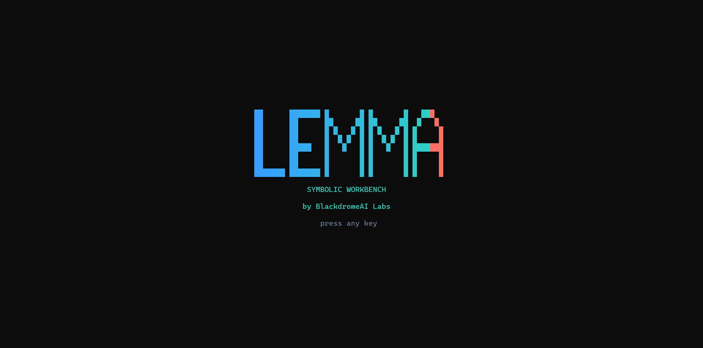
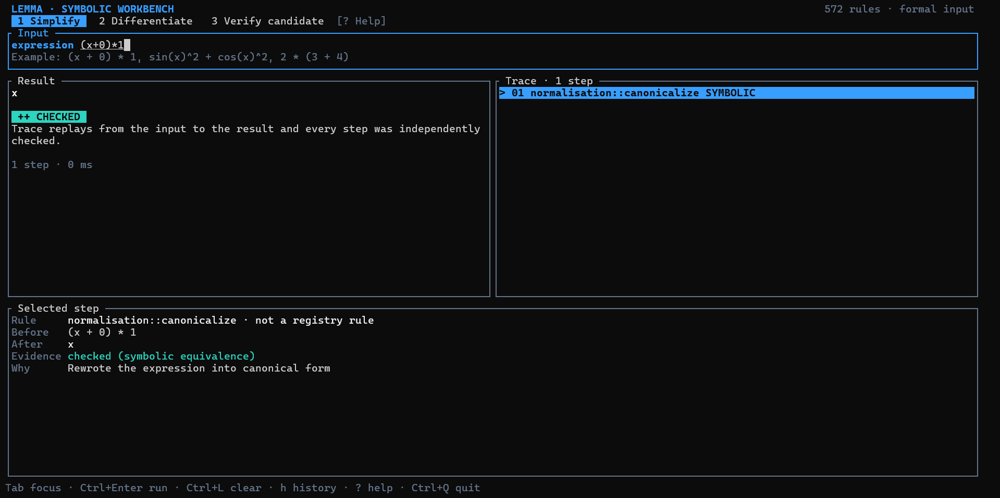

<div align="center">

# LEMMA

### Logical Engine for Multi-domain Mathematical Analysis

**An evidence-aware, neuro-symbolic mathematics research platform written in Rust.**

[](https://github.com/blackdromeai-labs/LEMMA/actions/workflows/ci.yml)
[](https://www.rust-lang.org/)
[](LICENSE)
[](#project-status)

[Quick start](#quick-start) · [Workbench](#terminal-workbench) · [Architecture](#architecture) · [Evaluation](#evaluation) · [Contributing](CONTRIBUTING.md)



</div>

---

LEMMA explores a simple question: **can learned search guide explicit mathematical
transformations without hiding what was applied or overstating what was verified?**

The workspace combines a typed expression language, a registry of mathematical rules,
beam/MCTS search, optional neural policy components, and a verifier that carries evidence
through to the final result. A terminal workbench makes the expression, trace, stable rule
identity, and verification status visible in one place.

> LEMMA is a research prototype, not a complete computer algebra system or theorem prover.
> It accepts formal expressions rather than natural-language problems, and no trained model
> is distributed with the repository.

## Terminal workbench

```bash
cargo run -p mm-tui
```

The workbench supports three honest operations:

- simplify a formal expression;
- differentiate with respect to a variable; and
- verify a proposed value for an equation.



A plain-text rendering of the same layout, for anywhere the image above doesn't load:

```text
 LEMMA · SYMBOLIC WORKBENCH                         572 rules · formal input
  1 Simplify   2 Differentiate   3 Verify candidate   [? Help]
┌ Input ──────────────────────────────────────────────────────────────────────┐
│ expression  (x + 0) * 1                                                    │
└────────────────────────────────────────────────────────────────────────────┘
┌ Result ─────────────────────────────┐┌ Trace · 2 steps ─────────────────────┐
│ x                                  ││ 01 algebra::identity_add_zero        │
│ ++ CHECKED                         ││ 02 algebra::identity_mul_one         │
│ 2 steps · 14 ms                    ││    symbolic equivalence              │
└────────────────────────────────────┘└───────────────────────────────────────┘
```

Press `?` in the application for the full key map. The responsive layout requires at least
an 80 × 24 terminal.

## Why LEMMA

- **Explicit transformations** — search chooses from a named rule registry instead of
  generating an untracked derivation.
- **Replayable traces** — every step records its before/after expressions, rule identity,
  justification, and evidence.
- **Evidence-aware results** — `VerificationStatus` distinguishes checked, heuristic,
  unverified, and unsupported outcomes.
- **Pluggable search** — beam search and MCTS share the symbolic substrate; policy guidance
  is optional and uniform priors are used when no trained model is available.
- **Fail-closed evaluation** — correctness tests assert exact expected expressions and fail
  when a required result or replayable trace is missing.

## Quick start

### Requirements

- a stable Rust toolchain;
- Git; and
- an 80 × 24 terminal to use the workbench.

```bash
git clone https://github.com/blackdromeai-labs/LEMMA.git
cd LEMMA

# Build every workspace target
cargo build --workspace

# Launch the interactive workbench
cargo run -p mm-tui

# Run the same core gates used by CI
cargo check --workspace --all-targets --locked -j 1
cargo test --workspace --lib --tests --locked -j 1
```

## Library example

```rust
use mm_solver::LemmaSolver;

fn main() -> Result<(), Box<dyn std::error::Error>> {
    let mut solver = LemmaSolver::new();
    let solution = solver.simplify("(x + 0) * 1")?;

    println!("result: {:?}", solution.result);
    println!("status: {}", solution.status);
    println!("steps: {}", solution.num_steps());
    Ok(())
}
```

`LemmaSolver::differentiate` evaluates derivative expressions and
`LemmaSolver::verify_solution` checks a supplied candidate. General equation solving through
`solve_for` and natural-language solving are deliberately reported as unsupported.

## Architecture

A typed expression AST flows through a stable rule registry and beam/MCTS search, with
optional neural priors, into a symbolic/numerical verifier that produces the result together
with its trace and evidence status. Ten crates, each with one job — see
[`docs/architecture.md`](docs/architecture.md) for the diagram and the crate-by-crate
breakdown.

## Verification model

Every result carries a `VerificationStatus` (`Checked` / `Heuristic` / `Unverified` /
`Unsupported`), not a boolean. This is equivalence checking, not a machine-checked proof —
there is no SMT backend. See [`docs/verification.md`](docs/verification.md) for what each
status means and for the calculus rule-replay boundary that keeps the verifier from
over-trusting a rule near an unevaluable expression.

## Evaluation

Fail-closed by design — exact expected values, replayable traces, and a witness census
measured by test, not asserted by hand. 572 rules registered; 138 transform at least one
witness in the current 228-expression corpus, 244 are no-ops, 190 are unreached. See
[`docs/evaluation.md`](docs/evaluation.md) for the commands, the current numbers, and the
seeded random-evaluation harness.

## Project status

What works today:

- parsing and formatting formal mathematical expressions;
- exact arithmetic and a measured subset of algebraic, calculus, trigonometric, equation,
  inequality, integration, number-theory, polynomial, and combinatoric transformations;
- beam/MCTS exploration with stable rule identities;
- replayable solution traces and explicit evidence levels; and
- an interactive TUI with render, end-to-end, and terminal-restoration tests.

Known boundaries:

- many registered entries are informational or no-op rules rather than executable
  transformations;
- witness coverage is incomplete, especially for geometry and advanced identities;
- general equation solving, natural-language problem solving, integration as a complete
  subsystem, limits, ODEs, and formal proof are not supported end to end;
- no pretrained policy artifact ships with the repository; and
- search is incomplete and may miss a valid transformation chain.

## Development

```bash
# Formatting
cargo fmt --all -- --check

# All targets and tests
cargo check --workspace --all-targets --locked -j 1
cargo test --workspace --lib --tests --locked -j 1
cargo test --workspace --doc --locked -j 1

# Stable, non-interactive render snapshots of the TUI
cargo run -p mm-tui --example capture_layouts
```

See [CONTRIBUTING.md](CONTRIBUTING.md) before adding rules or changing verifier behavior.
Every executable rule should include a targeted witness/test, a stable identity, and an
expected verification outcome.

## Research integrity

Report results with the command, revision, and exact test output that produced them — see
[`docs/evaluation.md`](docs/evaluation.md#research-integrity).

## License

LEMMA is available under the [Mozilla Public License 2.0](LICENSE).

---

<div align="center">

Built as an open research platform for inspectable mathematical search.

</div>
