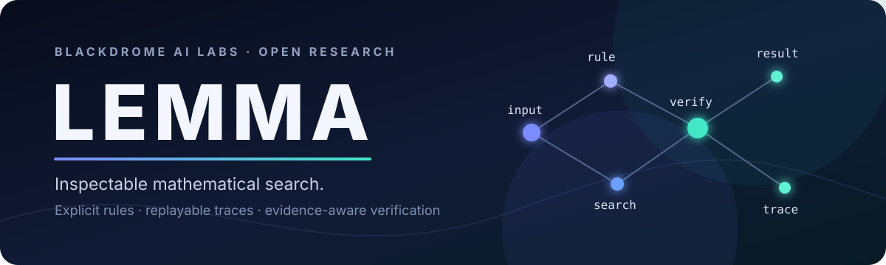
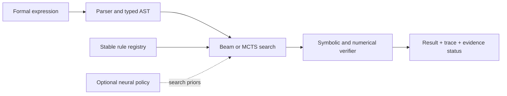

<div align="center">



# LEMMA

**Logical Engine for Multi-domain Mathematical Analysis**

An evidence-aware, neuro-symbolic mathematics research platform in Rust.

[](https://github.com/blackdromeai-labs/LEMMA/actions/workflows/ci.yml)
[](https://www.rust-lang.org/)
[](LICENSE)
[](#project-status)

Developed by **[Blackdrome AI Labs](https://github.com/blackdromeai-labs)**

[Get started](#quick-start) · [Explore the workbench](#terminal-workbench) · [Understand the system](#how-lemma-works) · [Read the docs](docs/architecture.md) · [Contribute](CONTRIBUTING.md)

</div>

---

## Mathematical search you can inspect

LEMMA explores how learned search can guide explicit symbolic transformations without
hiding the derivation or overstating the evidence behind an answer.

Instead of generating an opaque solution, LEMMA searches a stable registry of mathematical
rules, records every applied transformation, and returns the result with a precise
verification status.

| Explicit reasoning | Evidence-aware verification | Search research |
| :--- | :--- | :--- |
| Named rules and replayable before/after steps | Checked, heuristic, unverified, and unsupported are distinct outcomes | Beam search, MCTS, and optional neural policy guidance |

> [!IMPORTANT]
> LEMMA is an experimental research platform—not a complete CAS, theorem prover, or
> natural-language mathematics assistant. No pretrained policy model ships with the repository.

## Terminal workbench

Run the interactive interface and inspect a result alongside its derivation:

```bash
cargo run -p mm-tui
```

```text
 LEMMA · SYMBOLIC WORKBENCH                         572 rules · formal input
  1 Simplify   2 Differentiate   3 Verify candidate   [? Help]
┌ Input ──────────────────────────────────────────────────────────────────────┐
│ expression  (x + 0) * 1                                                    │
└────────────────────────────────────────────────────────────────────────────┘
┌ Result ─────────────────────────────┐┌ Trace · 2 steps ─────────────────────┐
│ x                                  ││ 01 algebra::identity_add_zero        │
│ ++ CHECKED                         ││ 02 algebra::identity_mul_one         │
│ 2 steps · 14 ms                    ││    symbolic equivalence              │
└────────────────────────────────────┘└───────────────────────────────────────┘
```

<p align="center">
  
</p>

The workbench supports formal-expression simplification, differentiation, and candidate
verification. It exposes stable rule identities, justifications, evidence, history, and a
responsive layout. Use an 80 × 24 terminal or larger and press `?` for the key map.

## Quick start

### 1. Clone and build

```bash
git clone https://github.com/blackdromeai-labs/LEMMA.git
cd LEMMA
cargo build --workspace
```

### 2. Launch LEMMA

```bash
cargo run -p mm-tui
```

### 3. Run the test suite

```bash
cargo check --workspace --all-targets --locked -j 1
cargo test --workspace --lib --tests --locked -j 1
```

**Requirements:** Git, a stable Rust toolchain, and an 80 × 24 terminal for the workbench.

## Use LEMMA as a library

```rust
use mm_solver::LemmaSolver;

fn main() -> Result<(), Box<dyn std::error::Error>> {
    let mut solver = LemmaSolver::new();
    let solution = solver.simplify("(x + 0) * 1")?;

    println!("result: {:?}", solution.result);
    println!("status: {}", solution.status);
    println!("steps: {}", solution.num_steps());
    Ok(())
}
```

The high-level API also provides `differentiate` and `verify_solution`. General equation
solving through `solve_for` and natural-language solving report themselves as unsupported.

## How LEMMA works



1. **Parse** the input into a typed expression tree.
2. **Search** transformations from the explicit rule registry.
3. **Verify** candidate steps using the available symbolic or numerical checks.
4. **Return** the result with a replayable trace and evidence status.

The neural layer can rank actions, but it never replaces rule execution or verification. When
no trained model is available, search uses uniform priors and reports that provenance.

For crate boundaries and data flow, see the [architecture guide](docs/architecture.md).

## Verification, without the hand-waving

| Status | What it guarantees |
| :--- | :--- |
| **Checked** | The trace replays from the exact input and every step was independently checked. |
| **Heuristic** | The trace replays, but one or more steps rely on weaker evidence such as rule replay or numerical sampling. |
| **Unverified** | A required replay or verification check failed. |
| **Unsupported** | The requested verification mode is not implemented. |

Verification here means equivalence checking by LEMMA's implemented symbolic checks, with
numerical sampling available as weaker evidence. It does not mean machine-checked formal proof,
and LEMMA currently has no SMT backend.

See [verification](docs/verification.md) for the complete evidence contract and verifier
boundaries.

## Workspace

| Layer | Crates | Responsibility |
| :--- | :--- | :--- |
| Foundation | `mm-core`, `mm-macro` | Expressions, parsing, canonicalization, evaluation, proof types, and macros |
| Reasoning | `mm-rules`, `mm-verifier`, `mm-boink` | Transformations, evidence checks, action vocabulary, and domain guardrails |
| Search | `mm-search`, `mm-brain` | Beam/MCTS exploration, policy learning, encoders, and model provenance |
| Product | `mm-solver`, `mm-tui` | Public solver API, orchestration, and terminal workbench |
| Data | `mm-synth` | Synthetic mathematical problem generation |

## Measured capability

LEMMA reports what its executable rules demonstrate on a pinned witness corpus—not how many
mathematical identities happen to be registered.

| 228-expression witness census | Rules |
| :--- | ---: |
| Registered | **572** |
| Transform at least one witness | **138** |
| Applicable but produce no changed expression | **244** |
| Not reached by this corpus | **190** |

Reproduce the census and verifier acceptance measurements:

```bash
cargo test -p mm-rules --test rule_census -- --nocapture
cargo test -p mm-verifier --test rule_acceptance -- --nocapture
cargo test -p mm-solver --test evaluation -- --nocapture
```

These figures describe one versioned corpus, not complete mathematical coverage. Earlier
headline benchmark scores were withdrawn after an audit found that the scripts could report
passes without failing the run and accepted overly broad output shapes.

The [evaluation guide](docs/evaluation.md) documents the current harnesses, provenance, and
research-integrity requirements.

## Project status

### Available today

- Formal mathematical expression parsing and formatting
- Exact arithmetic and a measured subset of symbolic transformations
- Beam search, MCTS, bidirectional exploration, and stable rule identities
- Replayable traces with explicit evidence levels
- Interactive Ratatui workbench with render and terminal-restoration tests

### Current boundaries

- Many registered entries remain informational or non-transforming
- Witness coverage is incomplete, particularly for geometry and advanced identities
- General equation solving, natural-language input, complete integration/limits/ODE support,
  and formal proof are not implemented end to end
- No pretrained neural-policy artifact is distributed
- Search is incomplete and can miss valid transformation chains

## Contributing

Contributions that improve executable rules, verification, witness coverage, search quality,
or documentation are welcome. Start with [CONTRIBUTING.md](CONTRIBUTING.md).

For a rule change, include:

- a stable `module::name` identity;
- a representative witness or focused test;
- an exact expected transformation; and
- the expected verification outcome.

Please report experimental results with the revision, command, configuration, model
provenance, and exact output used to produce them.

## License

LEMMA is open source under the [Mozilla Public License 2.0](LICENSE). MPL-2.0 keeps changes to
covered source files open when distributed while allowing LEMMA to be combined with separately
licensed—including proprietary—code.

---

<div align="center">

**Blackdrome AI Labs**

Building inspectable systems for mathematical reasoning.

</div>
