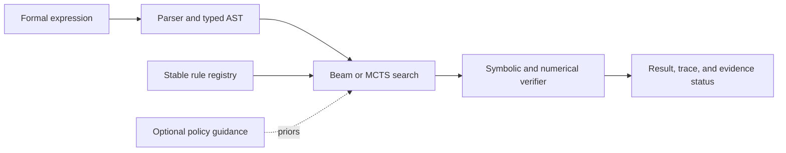

# Architecture

| Crate | Responsibility |
| --- | --- |
| `mm-core` | Expression AST, parser, canonicalization, evaluation, and proof types |
| `mm-rules` | Rule registry, transformations, stable action vocabulary, and witnesses |
| `mm-verifier` | Symbolic/numerical checks and evidence status |
| `mm-search` | Beam search, MCTS, bidirectional search, and trace integrity |
| `mm-solver` | High-level solver API and orchestration |
| `mm-tui` | Ratatui terminal workbench |
| `mm-brain` | Candle-based policy, encoding, training, and model provenance |
| `mm-synth` | Synthetic problem generation |
| `mm-boink` | Domain-based rule filtering for the search's pre-filter (see `docs/rules/overview.md`) |
| `mm-macro` | Procedural macro support |

The neural layer proposes search priors; it does not replace rule application or
verification. See [`rules/overview.md`](rules/overview.md) for how the rule registry and the
guardrail interact, and [`verification.md`](verification.md) for what the verifier actually
checks.
